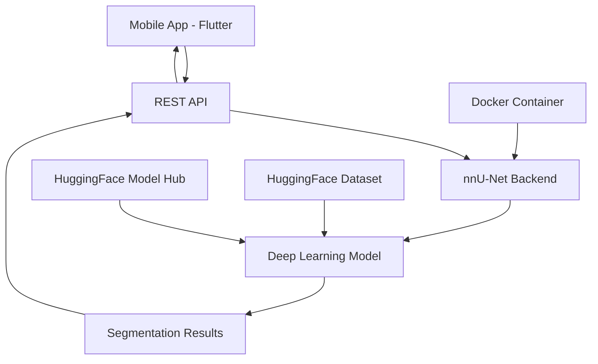

<div align="center">
  
# 🎗️ BreastSonoVision: AI-Powered Breast Ultrasound Segmentation

[](https://hub.docker.com/repository/docker/veyselch/nnunet-breast-cancer-api/general) [](https://huggingface.co/veyselozdemir/nnUNet-Breast-Cancer-Ultrasound) [](https://huggingface.co/datasets/veyselozdemir/nnUNet-Breast-Cancer-Ultrasound) [](https://flutter.dev) [](https://github.com/veysel-ozdemir/nnUNet)

**An AI-powered deep learning project for breast ultrasound image segmentation**

Utilizing advanced computer vision techniques and state-of-the-art neural networks, BreastSonoVision accurately detects and delineates breast abnormalities, assisting healthcare professionals in early diagnosis and medical research. The project combines a powerful nnU-Net backend with an intuitive Flutter mobile application to deliver comprehensive breast cancer detection capabilities. 🚀🔬

</div>

---

## 📋 Table of Contents

- [🌟 Project Overview](#-project-overview)
- [🏗️ Architecture](#%EF%B8%8F-architecture)
- [🚀 Components](#-components)
  - [Mobile Application](#-mobile-application-flutter)
  - [Backend API](#-backend-api-nnu-net)
- [📦 Resources](#-resources)
- [🛠️ Installation & Setup](#%EF%B8%8F-installation--setup)
- [🔧 Usage](#-usage)
- [🤝 Contributing](#-contributing)
- [⚠️ Medical Disclaimer](#%EF%B8%8F-medical-disclaimer)
- [📄 License](#-license)
- [👤 Contact](#-contact)

---

## 🌟 Project Overview

BreastSonoVision is a comprehensive AI-driven solution designed to revolutionize breast cancer detection through automated ultrasound image segmentation. The project consists of two main components working in tandem:

1. **Mobile Application (Flutter)**: A user-friendly cross-platform mobile app that allows healthcare professionals to capture, upload, and analyze breast ultrasound images in real-time
2. **Backend API (nnU-Net)**: A robust, containerized deep learning API powered by [nnU-Net](https://github.com/MIC-DKFZ/nnUNet) that performs state-of-the-art image segmentation

### ✨ Key Features

- 🧠 **AI-Powered Segmentation**: Advanced nnU-Net architecture for precise breast abnormality detection
- 📱 **Cross-Platform Mobile App**: Native Flutter application for iOS and Android
- 🐳 **Containerized Backend**: Docker-ready API with GPU/CPU support
- 🌐 **Real-time Processing**: Fast inference for immediate clinical feedback
- 🔒 **Privacy-First**: Local processing capabilities with secure data handling
- 🌍 **Multi-language Support**: Localized interface for global accessibility
- 📊 **Comprehensive Visualization**: Advanced result visualization and comparison tools

### 🎯 Target Audience

- **Healthcare Professionals**: Radiologists, oncologists, and medical technicians
- **Medical Researchers**: Scientists working on breast cancer detection and diagnosis
- **Healthcare Institutions**: Hospitals and clinics seeking AI-assisted diagnostic tools
- **AI Researchers**: Developers working on medical image segmentation

---

## 🏗️ Architecture

BreastSonoVision follows a modular architecture that separates concerns between the mobile frontend and AI backend:



### Data Flow
1. **Image Capture**: Healthcare professionals capture ultrasound images using the mobile app
2. **Secure Upload**: Images are securely transmitted to the backend API
3. **AI Processing**: nnU-Net processes the images and generates segmentation masks
4. **Result Delivery**: Processed results are returned to the mobile app
5. **Visualization**: Results are displayed with overlay visualizations and analysis tools

---

## 🚀 Components

### 📱 Mobile Application (Flutter)

The mobile application serves as the primary interface for healthcare professionals, providing an intuitive and powerful platform for breast ultrasound analysis.

#### 🌟 Features
- **Image Capture & Upload**: Support for camera capture and gallery selection
- **Real-time Processing**: Live connection to backend API for immediate results
- **Advanced Visualization**: Segmentation overlays, comparison tools, and detailed analysis
- **Notification System**: Scheduled reminders and result notifications
- **Multi-language Support**: Localized interface for global accessibility
- **Export & Share**: Easy sharing of results with medical teams
- **Offline Capabilities**: Local storage and processing options

#### 🛠️ Technical Stack
- **Framework**: Flutter (3.24.5+)
- **Language**: Dart (3.5.4+)
- **State Management**: GetX
- **UI Framework**: Material Design with custom medical UI components
- **Local Storage**: SharedPreferences with encryption
- **Image Processing**: Advanced image manipulation and display
- **Networking**: HTTP client with secure API communication

#### 📱 Screenshots & UI
The application features a comprehensive user interface including:
- Welcoming onboarding experience
- Intuitive home dashboard
- Advanced image analysis tools
- Detailed result visualization
- Settings and preferences management

**Repository**: [breast-sono-vision-mobile](https://github.com/veysel-ozdemir/breast-sono-vision-mobile)

---

### 🧠 Backend API (nnU-Net)

The backend API provides the core AI functionality, leveraging the power of nnU-Net for state-of-the-art medical image segmentation.

#### 🌟 Features
- **nnU-Net Integration**: Latest nnU-Net v2 architecture with automatic pipeline optimization
- **Multi-Device Support**: Optimized for CPU, CUDA, and Apple Silicon (MPS)
- **RESTful API**: Clean API design with comprehensive endpoints
- **Containerized Deployment**: Docker-ready with production optimizations
- **High Performance**: Optimized inference with GPU acceleration
- **Scalable Architecture**: Designed for clinical deployment scenarios

#### 🛠️ Technical Stack
- **Framework**: Flask with CORS support
- **AI Library**: nnU-Net v2 with PyTorch backend
- **Image Processing**: PIL, NumPy for advanced image manipulation
- **Containerization**: Docker with multi-stage builds
- **Device Support**: CPU, CUDA, Apple Silicon (MPS)
- **Model Format**: PyTorch checkpoints with automatic optimization

#### 🔧 API Endpoints
- `POST /predict`: Main inference endpoint for image segmentation
- `GET /health`: Health check endpoint for monitoring
- `GET /model-info`: Model information and configuration details

#### ⚙️ Configuration
The API supports flexible configuration through environment variables:
- `MODEL_DIR`: Path to trained model directory
- `CHECKPOINT_NAME`: Model checkpoint filename
- `MODEL_FOLD`: Training fold configuration
- `PORT`: API service port (default: 5050)

**Repository**: [nnUNet](https://github.com/veysel-ozdemir/nnUNet)

---

## 📦 Resources

### 🤗 HuggingFace Hub Resources

#### 🎯 Pre-trained Model
**[nnUNet-Breast-Cancer-Ultrasound Model](https://huggingface.co/veyselozdemir/nnUNet-Breast-Cancer-Ultrasound)**
- Trained nnU-Net model specifically optimized for breast ultrasound segmentation
- Supports both 2D and 3D inference modes
- Optimized for clinical deployment with high accuracy metrics
- Compatible with nnU-Net v2 inference pipeline

#### 📊 Training Dataset
**[nnUNet-Breast-Cancer-Ultrasound Dataset](https://huggingface.co/datasets/veyselozdemir/nnUNet-Breast-Cancer-Ultrasound)**
- Comprehensive breast ultrasound dataset with expert annotations
- Diverse patient demographics and imaging conditions
- High-quality segmentation masks for abnormality detection
- Preprocessed and formatted for nnU-Net training

### 🐳 Docker Hub

#### 🚢 Production-Ready Container
**[nnunet-breast-cancer-api](https://hub.docker.com/repository/docker/veyselch/nnunet-breast-cancer-api/general)**
- Pre-built Docker image with optimized nnU-Net backend
- Multi-architecture support (x86_64, ARM64)
- Production-ready with security best practices
- Easy deployment with Docker Compose

```bash
# Quick deployment
docker pull veyselch/nnunet-breast-cancer-api:latest
docker run -p 5050:5050 veyselch/nnunet-breast-cancer-api:latest
```

---

## 🛠️ Installation & Setup

### Prerequisites
- **For Mobile App**: Flutter SDK 3.24.5+, Dart 3.5.4+
- **For Backend**: Python 3.10+, Docker (optional)
- **Hardware**: GPU recommended for optimal performance

### 🚀 Quick Start with Docker

```bash
# Clone the repository
git clone --recursive https://github.com/veysel-ozdemir/breast-sono-vision.git
cd breast-sono-vision

# Start the backend API
cd nnUNet
docker-compose up -d

# Setup mobile application
cd ../breast-sono-vision-mobile/breast_sono_vision
flutter pub get
flutter run
```

### 🔧 Development Setup

#### Backend API Setup
```bash
cd nnUNet

# Create virtual environment
python -m venv venv
source venv/bin/activate  # On Windows: venv\Scripts\activate

# Install dependencies
pip install -r requirements.txt

# Set environment variables
export MODEL_DIR="path/to/your/model"
export CHECKPOINT_NAME="checkpoint_final.pth"

# Run the API
python api.py
```

#### Mobile App Setup
```bash
cd breast-sono-vision-mobile/breast_sono_vision

# Install dependencies
flutter pub get

# Configure environment
cp .env.example .env
# Edit .env with your API endpoints

# Run the app
flutter run
```

---

## 🔧 Usage

### For Healthcare Professionals

1. **Setup**: Install the mobile application on your device
2. **Configuration**: Configure API endpoints in app settings
3. **Image Capture**: Use the app to capture or upload ultrasound images
4. **Analysis**: Submit images for AI-powered segmentation analysis
5. **Review Results**: Examine segmentation results with visualization tools
6. **Export/Share**: Share results with medical teams or export for records

### For Developers

1. **Model Training**: Use the provided dataset to train custom models
2. **API Integration**: Integrate the backend API into existing medical systems
3. **Customization**: Extend the mobile app with additional features
4. **Deployment**: Deploy using Docker containers for production use

### API Usage Example

```python
import requests
import base64

# Prepare image
with open('ultrasound_image.jpg', 'rb') as f:
    image_data = base64.b64encode(f.read()).decode('utf-8')

# Send prediction request
response = requests.post(
    'http://localhost:5050/predict',
    json={'image': image_data}
)

# Get segmentation result
result = response.json()
segmentation_mask = result['segmentation']
```

---

## 🤝 Contributing

We welcome contributions from the medical and AI communities! Here's how you can help:

### 🔬 For Medical Professionals
- **Dataset Contribution**: Share anonymized ultrasound data for model improvement
- **Clinical Validation**: Test the application in clinical settings and provide feedback
- **Feature Requests**: Suggest new features based on clinical needs

### 💻 For Developers
- **Code Contributions**: Submit pull requests for bug fixes and new features
- **Model Improvements**: Contribute enhanced models or training techniques
- **Documentation**: Help improve documentation and tutorials

### 📋 Contribution Guidelines
1. Fork the repository
2. Create a feature branch (`git checkout -b feature/amazing-feature`)
3. Commit your changes (`git commit -m 'Add amazing feature'`)
4. Push to the branch (`git push origin feature/amazing-feature`)
5. Open a Pull Request

---

## ⚠️ Medical Disclaimer

**IMPORTANT MEDICAL NOTICE**

This application is designed as a **diagnostic aid tool** for qualified healthcare professionals and should **NOT** be used as the sole basis for medical diagnosis. 

### Key Points:
- ✅ **Use as a supplementary diagnostic tool only**
- ✅ **Always consult with qualified medical professionals**
- ✅ **Follow established medical protocols and guidelines**
- ❌ **Do not use for primary diagnosis without professional oversight**
- ❌ **Not intended for use by non-medical personnel**

### Regulatory Compliance:
- This software has not been evaluated by regulatory agencies (FDA, CE, etc.)
- Not intended for commercial diagnostic use without proper certification
- Users are responsible for compliance with local regulations

The developers assume no responsibility for medical decisions made using this software. Always prioritize professional medical judgment and established diagnostic procedures.

---

## 📄 License

This project is licensed under the MIT License - see the [LICENSE](LICENSE) file for details.

### Third-Party Licenses:
- **nnU-Net**: Apache License 2.0 - see [nnUNet/LICENSE](nnUNet/LICENSE)
- **Flutter**: BSD 3-Clause License

---

## 👤 Contact

**Veysel Ozdemir** - Software Developer

### 📬 Contact Information:
- **Email**: ozdemirsoftware.dev@gmail.com
- **GitHub**: [@veysel-ozdemir](https://github.com/veysel-ozdemir/)
- **LinkedIn**: [Veysel Ozdemir](https://www.linkedin.com/in/ozdemir-veysel/)

### 📱 App Store Presence:
- **Apple App Store**: [Developer Page](https://apps.apple.com/de/developer/veysel-ozdemir/id1791593374)
- **Google Play Store**: [Developer Page](https://play.google.com/store/apps/dev?id=7737397220295288084&pli=1)

### 🔗 Project Links:
- **Docker Hub**: [nnunet-breast-cancer-api](https://hub.docker.com/repository/docker/veyselch/nnunet-breast-cancer-api/general)
- **HuggingFace Model**: [nnUNet-Breast-Cancer-Ultrasound](https://huggingface.co/veyselozdemir/nnUNet-Breast-Cancer-Ultrasound)
- **HuggingFace Dataset**: [Training Dataset](https://huggingface.co/datasets/veyselozdemir/nnUNet-Breast-Cancer-Ultrasound)

---

## 🙏 Acknowledgments

### Medical Community:
- Healthcare professionals who provided domain expertise and clinical insights
- Medical institutions supporting AI-assisted diagnostic research
- Radiologists and oncologists who contributed to dataset validation

### Technical Community:
- **nnU-Net Team** at DKFZ for the outstanding segmentation framework
- **Flutter Team** for the excellent mobile development platform
- **HuggingFace** for providing model and dataset hosting infrastructure
- **Docker** community for containerization best practices

### Research Institutions:
- Medical imaging research communities
- Open-source contributors and maintainers
- AI in healthcare research initiatives

---

<div align="center">

## 🎗️ Making Breast Cancer Detection More Accessible Through Technology

**Together, we can improve early detection and save lives.**

[](https://github.com/veysel-ozdemir/breast-sono-vision) [](https://github.com/veysel-ozdemir/breast-sono-vision/network/members) [](https://github.com/veysel-ozdemir)

</div>
